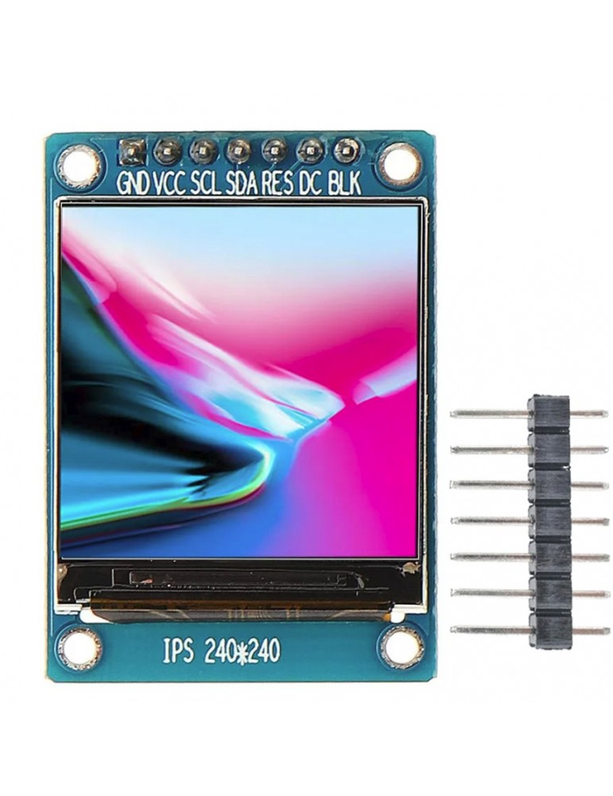

# SENSORES Y ACTUADORES

### Actividad
 *** Ejercicio #1 *** 
1) Como funcionan los Display 7 segmentos gigantes y cuales son sus aplicaciones
2) Como funcionan las pantallas gigantes de matriz de puntos y cuales son sus aplicaciones
3) Como funcionan las pantallas LCD y Oled gigantes y cuales son sus aplicaciones
4) Que tecnoloia se podria utilizar para hacer una pantalla gigante tactil (SAW)
5) Cual es la diferencia entre Oled SPI y Oled I2C?
6) Cuales son las ventajas y desventajas de una pantalla Nextion
7) Elija una aplicacion (Wokwi, Proteus) con alguno de los visualizadores vistos e implementela con un simulador.

#### Fecha de Entrega: 20/10/23.